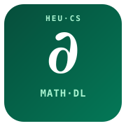

# Mathematical Foundations of Deep Learning

**Harbin Engineering University · Computer Science**

_A senior-undergraduate / MS-PhD elective._ The real analysis, linear algebra, probability,
and optimization that actually govern neural networks — with every result paired to a
runnable check, so "theory" stays as concrete as code.



## Overview
Learn the machinery behind deep learning, not just slogans. Each week introduces a
theoretical object, states the claim precisely, and immediately verifies it numerically in
Python.

1. **Linear algebra for nets** — spectra, norms, eigs of dense vs. conv layers.
2. **Calculus / optimization** — gradients, Hessians, convexity, gradient flow.
3. **Probability & information** — expectations, KL/entropy, concentration.
4. **Generalization theory** — Rademacher/V-C ideas, why "more params ≠ more overfit".
5. **Geometry of learning** — manifolds, Fisher information, flat vs. sharp minima.

| Week | Topic | Source |
|---|---|---|
| 1 | Spectra and norms of weight matrices | `code/01_spectra.py` |
| 2 | Gradient flow and learning-rate limits | `code/02_flow.py` |
| 3 | Concentration & the law of large numbers | `code/03_concentration.py` |
| 4 | Entropy, KL, and cross-entropy in-class | `code/04_kl.py` |
| 5 | Local geometry: Hessian & flat minima | `code/05_hessian.py` |

## Prerequisites
- Calculus I/II, linear algebra, basic probability
- Python + `numpy`, `scipy`, `matplotlib` (no deep learning package needed)

## Set up
```bash
git clone git@github.com:dapenglang/math-foundations-deep-learning.git
cd math-foundations-deep-learning
pip install numpy scipy matplotlib
python code/01_spectra.py
```

## Grading
- Weekly numerical-exercise reports: 50%
- Midterm proof + experiment: 20%
- Final "theory→experiment" portfolio: 30%

See `docs/syllabus.md`.

_Teaching scaffold — verify all statements and citations before the live term._